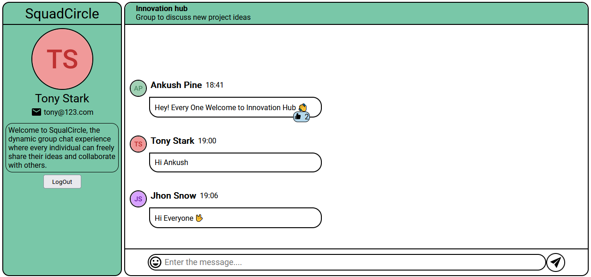

# 📱 **Squad Circle** 🌀

Squad Circle is your ultimate destination for seamless group chats! Connect with your squad effortlessly and stay in the loop with real-time conversations.
Start chatting with your squad today and experience the joy of staying connected!

### 🌐 Hosted Link : [Link](https://pine-squad-circle.netlify.app/)

### 🎞 Vedio Links :
- Basics : [Link](https://drive.google.com/file/d/1WaPu3lFPzlBHPE8wzMCvbPZ3nk8TSKv9/view?usp=sharing)
- Real time chat : [Link](https://drive.google.com/file/d/1sxWCTGQWW6HMR8IV2z5lA2pdXWQIu4FM/view?usp=sharing)

### 🖼 Image :

## Functionalities:
🔐 **User Authentication**: Register and login securely to access the chat platform.  
📝 **User Profiles**: Display user details like name and email conveniently on the right side.  
💬 **Real-Time Chat**: Engage in lively conversations with your squad in real-time.  
❤️ **Like Feature**: Show some love by liking your own and others' messages.

## 🖥️ Frontend
- The frontend part is in the client file.
- The client side is built on Vite+React.
- The frontend is deployed on Netlify .

### 🛠️ Tools Used:
- react-icons
- react-router-dom
- react-hot-toast
- axios
- socket.io-client

## ⚙️ Backend 
- The backend part is in the server file.
- The server API is built on NodeJS and MongoDB.
- The server API is deployed on Render.

### 🛠️ Libraries Used:
- cors
- dotenv
- express
- mongoose
- nodemon
- bcrypt
- socket.io

  ## How to setup the project on local system 💻:
- Clone this project to your local system.
- For client and server files individually follow the bellow steps.
- Run `npm install` to install required dependencies.
- Run `npm start` to start the server app.
- Run `npm run dev` to start the client app.
